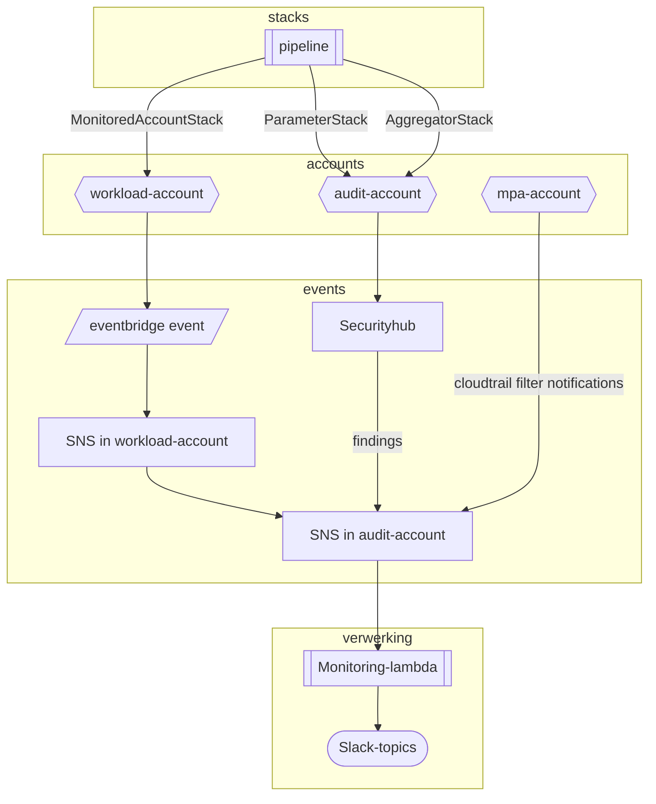
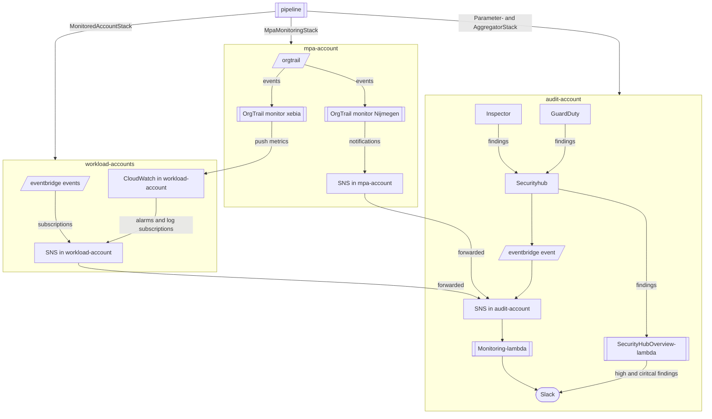

# Setup of monitoring in Nijmegen LZ

We're interested in landingzone-wide events (e.g. cloudtrail, securityhub are aggregated centrally) and workload-specific events. All workload-events we're interested in are sent to one of 4 priority SNS-topics. These topics
auto-forward to a matching topic in the audit account. A lambda function listens in the audit-account, and processes any (all?) relevant messages, and posts these to a (priority-specific) slack topic. 

The pipeline is set up as follows:
- The central pipeline creates an `AggregatorStack` in the audit-account. This is the stack responsible for subscribing to SNS and forwarding to Slack.
- The central pipeline creates a `MonitoredAccountStack` in *each* workload-account. This stack is responsible for pushing relevant events to the workload SNS topics. This is mostly done by adding eventbridge rules with the topic as target and creating cloudwatch alarms. (TODO: How do alarms get to the audit account?)

A rough diagram:

  
A more detailed diagram

  Below we'll find a more detailed diagram of the monitoring troughout the landingzone.
  

 

## Slack interaction
[Slack interaction documentation can be found here](./SlackInteraction.md)