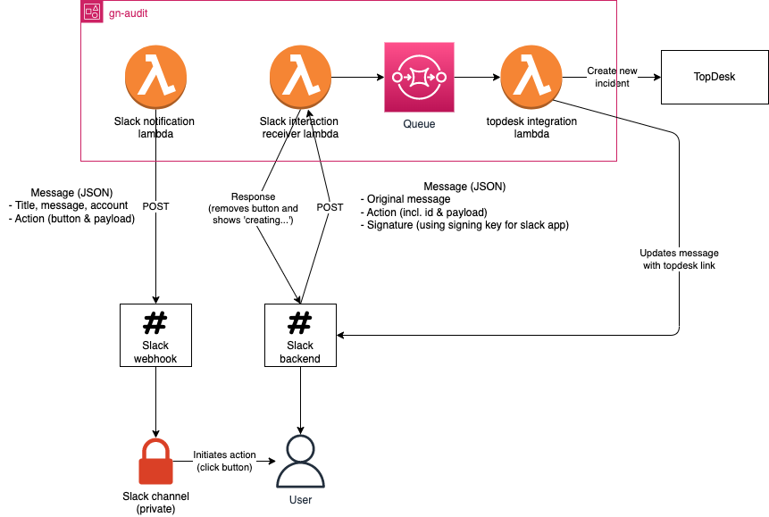

# Slack interaction

The basic flow is as follows:



## Example messages
An example payload that is posed to the slack webhooks by the [Monitoring or Slack Notification Lambda](../src/monitoringLambda/) is given below:
```json
{
    "blocks": [
        {
            "type": "section",
            "text": {
                "type": "mrkdwn",
                "text": "Description."
            }
        },
        {
            "type": "actions",
            "elements": [
                {
                    "type": "button",
                    "text": {
                        "type": "plain_text",
                        "text": "Create TopDesk ticket",
                        "emoji": true
                    },
                    "value": "<base64 encoded JSON object that is send on the interaction>",
                    "action_id": "create-topdesk-ticket"
                }
            ]
        }
    ]
}
```


An example of the message send by slack to the [Slack Interaction Lambda](../src/SlackInteractivityLambda/) is also given below:
```json 
{
    "type": "block_actions",
    "message": "<the original message posted to slack>",
    "response_url": "https://hooks.slack.com/actions/xxxx/xxxx/xxxx",
    "actions": [
        {
            "action_id": "create-topdesk-ticket",
            "block_id": "AqF",
            "text": {
                "type": "plain_text",
                "text": "Create TopDesk ticket",
                "emoji": true
            },
            "value": "<base64 encoded JSON object that is send on the interaction>",
            "type": "button",
            "action_ts": "1683617750.339739"
        }
    ]
}
```


The payload that is base64 decoded is a JSON object like:
```json
{
  "title": "Issue title",
  "description": "Issue description",
  "priority": "critical|high|medium|low"
}
```