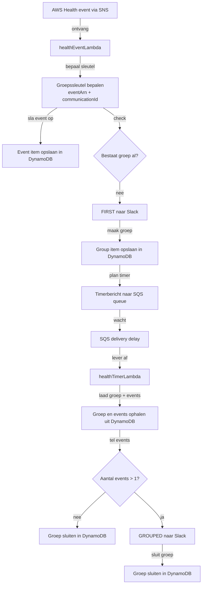

# AWS Health grouping

AWS Health-berichten kunnen voor meerdere accounts inhoudelijk hetzelfde zijn.

Bij een grotere issue of outage is `detail.eventArn` meestal hetzelfde voor het bredere Health-incident over die accounts heen. Bijvoorbeeld een outage van Cloudfront wereldwijd. Dat raakt veel accounts en AWS zal dan gedurende het incident meerdere updates geven over de voortgang.

Binnen datzelfde incident heeft iedere inhoudelijke update een eigen `detail.communicationId`.

`detail.eventScopeCode` is volgens AWS `PUBLIC` of `ACCOUNT_SPECIFIC`.
Voor deze eerste iteratie is dat minder bepalend, omdat we het eerste Health-event altijd direct naar Slack sturen en pas vervolgevents groeperen.

Praktisch:

- zelfde `eventArn` + zelfde `communicationId`
  - zelfde communicatie over meerdere accounts
- zelfde `eventArn` + andere `communicationId`
  - zelfde incident, maar een andere inhoudelijke update

Voor grouping op hetzelfde Slack-bericht is `detail.communicationId` daarom de belangrijkste sleutel.

## Functionele flow

AWS docs:
https://docs.aws.amazon.com/health/latest/ug/aws-health-events-eventbridge-schema.html
https://docs.aws.amazon.com/health/latest/ug/pagnation-of-health-events.html
