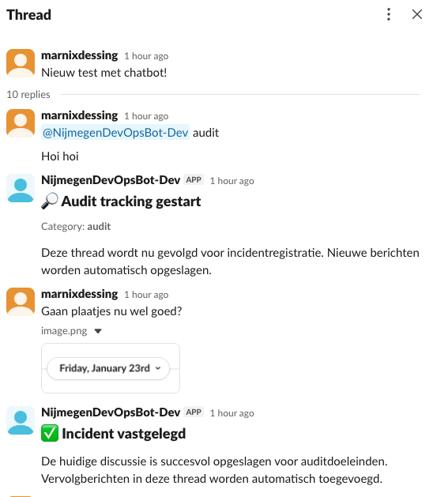
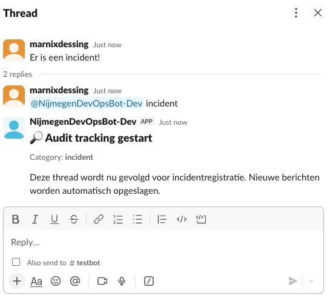

# Audit slackbot

## Features
- Start tracking by mentioning the bot
- Stores thread messages and attached files to messages
- Backup every hour for the first 24 hours, then once a day.
- Stores to S3 the thread (JSON) and attachments.

## How to use
- Start tracking: `@auditbot <audit|incident>`. (keyword is audit or incident to determine catagory).

## Impression
The two screenshots below should give an impression of the usage and interaction with the slackbot.

### Audit:

### Incident:
