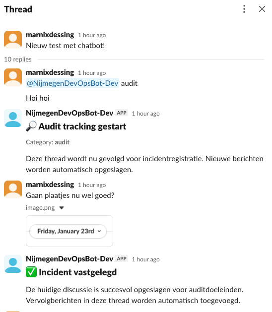
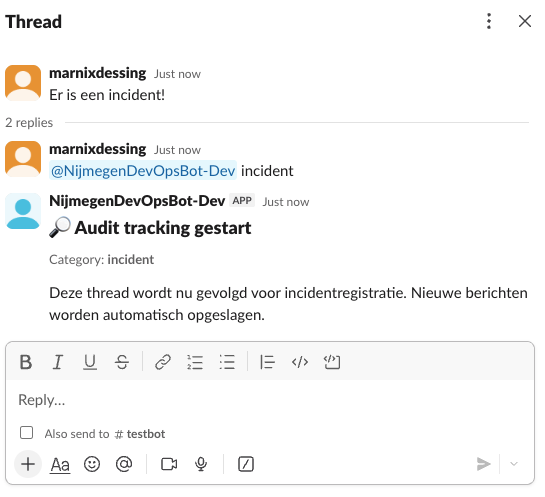

# Audit slackbot

## Features
- Start tracking by mentioning the bot
- Stores thread messages and attached files to messages
- Backup every hour for the first 24 hours, then once a day.
- Stores to S3 the thread (JSON) and attachments.
- Store each thread separately to account for changes and updates an create a audit log for each thread.

## How to use
- Start tracking: `@auditbot <audit|incident>`. (keyword is audit or incident to determine catagory).

## Impression
The two screenshots below should give an impression of the usage and interaction with the slackbot.

### Audit:

### Incident:

# Openstaande punten
- Een thread verwijderen

# How to deploy
- Take the manifest json file
- Create a new app over at api.slack.com/apps using the manifest
- Sync secrets from Slack to secretsmanager in AWS gn-audit account.